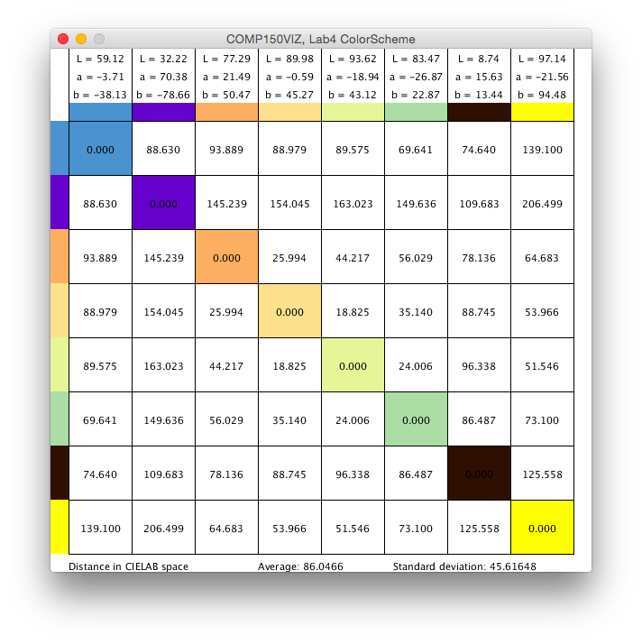

1. Started with Tufts Blue, because why not?

2. Jump to yellow as final anchor, because they seem very different.
  The idea is that we\'ll be able to hit the outsides, and then build inwards

3. ZigZag around the color wheel. Since Blue and Yellow are across from each other,
  we can pick 3 on each side.
  

4. Abort that plan. Makes more sense to spiral from the outside, around the circle,
  and in. This means that each value will be different in base color, and the first and
  last colors will be different more in brightness than in color.
  

5. QED
