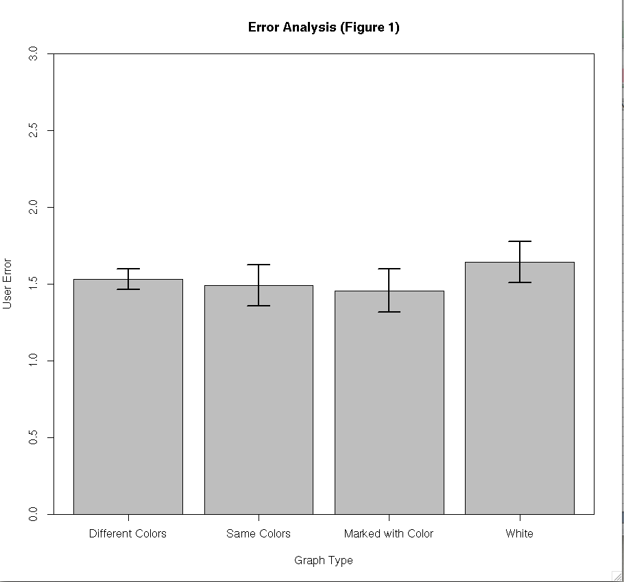

##Comp 150 - Visualization, Assignment 5##

* Ben deButts
* Susie Kharraz-Post
* Tyler Lubeck

### Results ###

To calculate the Confidence Intervals, we relied on the power that is 'R'.
We loaded our data in to an excel file, then loaded the excel file in to 'R'. 
'R' allowed us to easily parse the columns of this file, and we used the built
in 'qt' function to perform the analysis. 

This analysis showed that white bars were by far the worst, and bars with the
same colors were best. This disproves our hypothesis, where we thought that bars
with all different colors would allow for the easiest user experience.

### Normal Distributions ###

Running Shapiro tests over all of the data showed that none of it was normally
distributed. Yet again, 'R' made this easy. We used the built in Shapiro-Wilk
test. You can find the results in the table below.

### Statistically Significant Differences ###

Because the data was not normally distributed, and we tested multiple 
conditions, we had to perform a manual Kruskal-Wallis test. The Kruskal-Wallis
test showed that even after modifying the p-value to account for the multiple
test factors, we still don't have any statistically significant data. Taking
a look at the Bonferroni Correction shows that this is likely, because it tells
us that there is only a 14.26% chance of there being a statistically significant
value in our tests.

### Tables ###

#### Shapiro-Wilk Test Results ####
|Test|Mean|P Value|
|----|----|-------|
|Different Colors|1.53|6.44x10-16|
|Same Colors|1.49|3.88x10-05|
|Marked with Color|1.46|5.48x10-7|
|White|1.64|1.58x10-7|

Since the P Values for these tests are significantly lower than the critical
value of 0.05, we know that the results are not normally distributed

#### Kruskal-Wallis Test Results ####

|Pair|X2|P Value|
|----|-------------|-------|
|Different Colors & Same Colors|297.55|0.50|
|Different Colors & Marked with Color|299.00|0.47|
|Different Colors & White|302.57|0.46|
|Same Colors & Marked with Color|297.23|0.50|
|Same Colors & White|296.55|0.50|
|Marked With Color & White|295.56|0.51|

This test tells us that there is no statistically significant differences in
our population.

